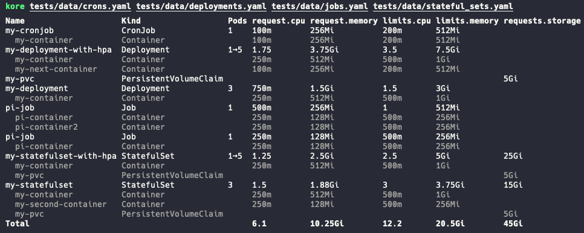

# kore

### (kubernetes object resources)

CLI tool to parse and sum limits and requests from kubernetes YAMLs



### 🚧 Waring: WIP 🚧

### Install instructions

- clone repo
- install as command with `deno run install`

### Usage

#### Pipe in relevant objects from namespace
```
kubectl get deployments,hpa,sts,pvc,jobs -n my-namespace -o yaml | yq eval '.items[] | "---" + "\n" + (. | tostring)' - > deployment.yaml
kore deployment.yaml
```

#### Parse one or more yaml files
```
kore first-deployment.yml second-deployment.yml
```
